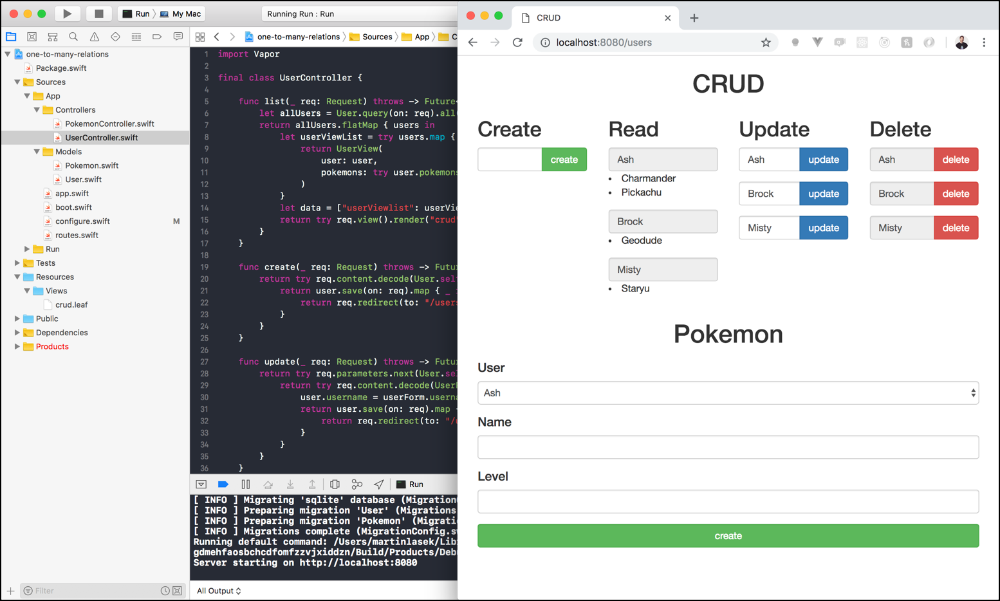

  <h2>One-To-Many Relations 👨🏼‍💻 </h2>
  <h3>Tutorial to build this project</h3>
  <h4><a href="https://medium.com/@martinlasek/tutorial-how-to-build-one-to-many-relations-fc31eb888a8d">How to build one-to-many relations</a></h4>
   

  

## Community 🚀
Join the awesome and welcoming Vapor community in <a href="http://vapor.team/"><b>Slack!</b></a>
